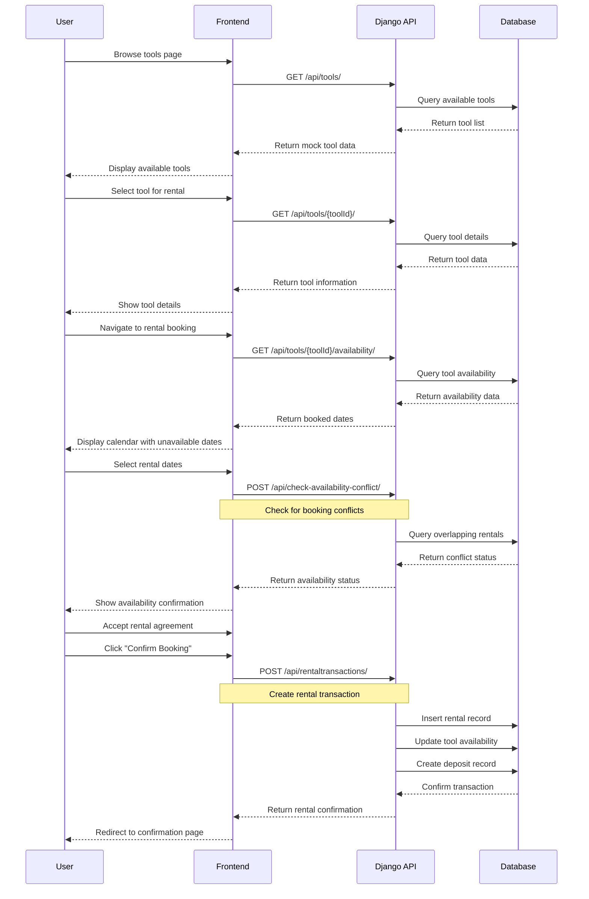
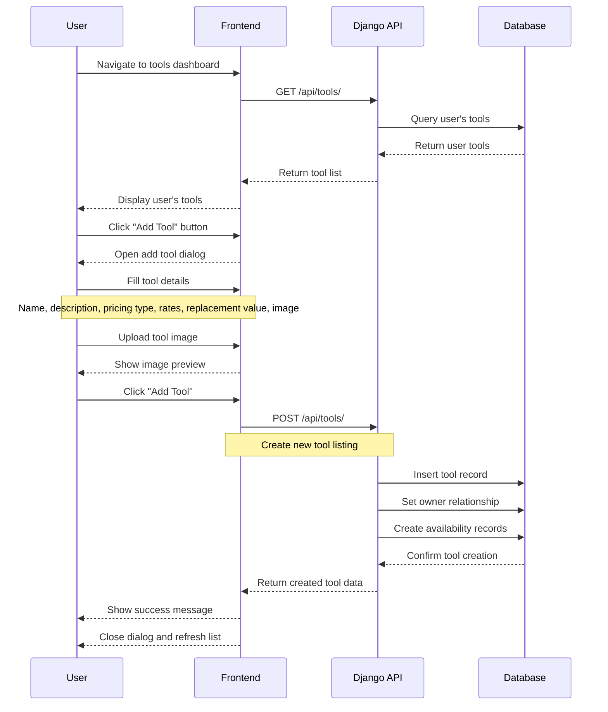
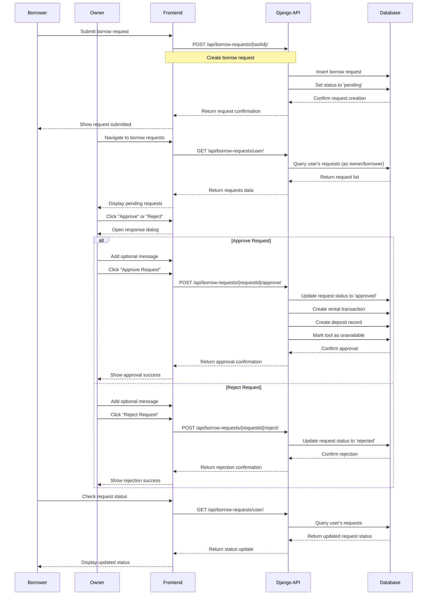
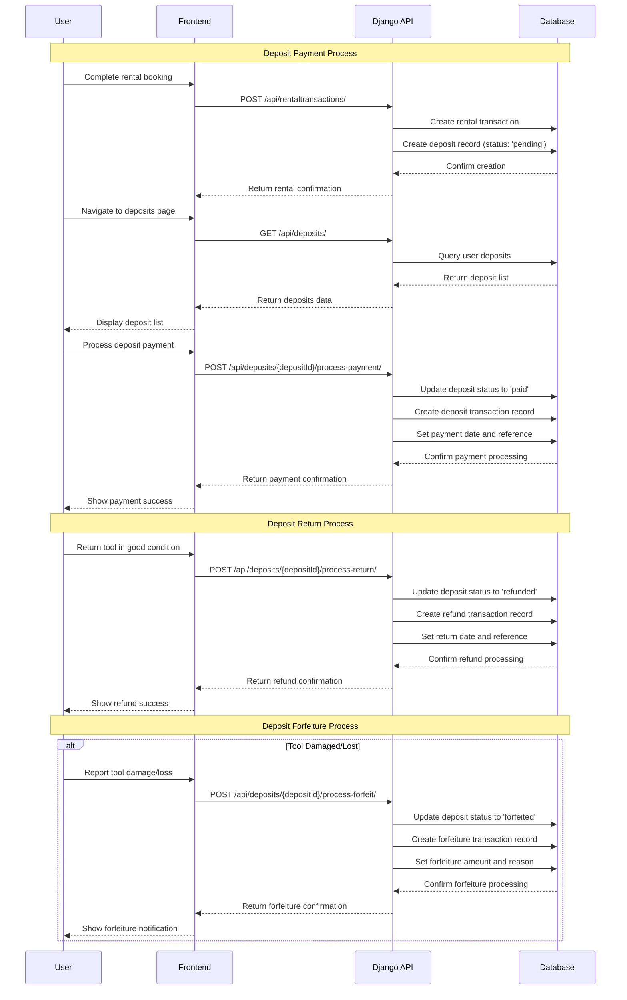
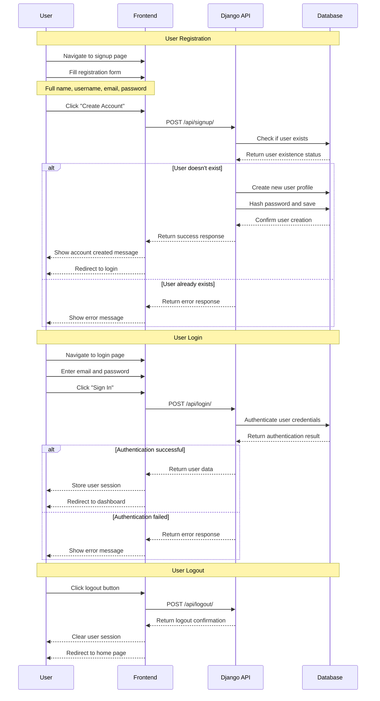

# Core Flows - Sequence Diagrams

This document illustrates the core user workflows in the EquiShare tool sharing platform using sequence diagrams.

## 1. Tool Rental Booking Flow

The tool rental booking flow allows users to browse available tools, select dates, and complete a rental transaction.

## 2. Tool Listing Creation Flow

The tool listing creation flow allows tool owners to add their tools to the platform for rental.

## 3. Borrow Request Management Flow

The borrow request management flow handles the approval process for tool borrowing requests.

## 4. Deposit Management Flow

The deposit management flow handles the security deposit process for tool rentals.

## 5. User Authentication Flow

The user authentication flow handles user registration and login.

## Key System Components

### Frontend Components
- **React/Next.js**: Main frontend framework
- **UI Components**: Reusable components for forms, dialogs, tables
- **State Management**: Local state and context for user authentication
- **API Integration**: HTTP requests to Django backend

### Backend Components
- **Django REST Framework**: API framework
- **Models**: Database models for users, tools, rentals, deposits
- **Views**: API endpoints for CRUD operations
- **Serializers**: Data validation and transformation
- **MySQL Database**: Primary data storage

### Core Features
- **User Authentication**: Registration, login, logout
- **Tool Management**: Create, update, delete tool listings
- **Rental System**: Book tools, manage availability
- **Borrow Requests**: Request-approval workflow
- **Deposit Management**: Security deposit handling
- **Availability Tracking**: Real-time availability updates
- **Location Services**: Geographic tool search
- **Review System**: User and tool ratings

### Security Features
- **User Verification**: Identity verification system
- **Dispute Resolution**: Conflict management
- **Payment Security**: Secure deposit handling
- **Access Control**: User role-based permissions

This comprehensive flow documentation provides a clear understanding of how users interact with the EquiShare platform across the main use cases. 