# Entity-Relationship Diagram (ERD)

This document provides a comprehensive Entity-Relationship Diagram for the EquiShare tool sharing platform, showing all entities, their attributes, relationships, and cardinalities.

## ER Diagram

```mermaid
erDiagram
    %% User Management Entities
    UserProfile {
        int id PK
        string username UK
        string email UK
        string password_hash
        string first_name
        string last_name
        string phone_number
        text address
        string city
        string state
        string zip_code
        string country
        boolean is_owner
        boolean is_borrower
        string profile_picture
        text bio
        decimal rating
        int total_rentals
        decimal latitude
        decimal longitude
        datetime created_at
        datetime updated_at
    }

    UserVerification {
        int id PK
        int user_id FK
        string verification_type
        string document_front
        string document_back
        string status
        datetime submitted_at
        datetime reviewed_at
        int reviewed_by FK
        text notes
    }

    ApplicationReview {
        int id PK
        int user_id FK
        int reviewer_id FK
        string status
        text notes
        datetime created_at
        datetime updated_at
    }

    %% Tool Management Entities
    Tool {
        int id PK
        string name
        text description
        string image
        string pricing_type
        decimal price_per_hour
        decimal price_per_day
        decimal price_per_week
        decimal price_per_month
        decimal replacement_value
        boolean available
        int owner_id FK
        text pickup_address
        string pickup_city
        string pickup_state
        string pickup_zip_code
        decimal pickup_latitude
        decimal pickup_longitude
        boolean delivery_available
        int delivery_radius
        decimal delivery_fee
        decimal latitude
        decimal longitude
        datetime created_at
    }

    %% Availability Management Entities
    Availability {
        int id PK
        int tool_id FK
        date start_date
        date end_date
        boolean is_booked
        text notes
        datetime created_at
        datetime updated_at
    }

    FlexibleAvailability {
        int id PK
        int tool_id FK
        date start_date
        date end_date
        boolean is_available
        text notes
        datetime created_at
    }

    RecurringAvailability {
        int id PK
        int tool_id FK
        string pattern_type
        date start_date
        date end_date
        json days_of_week
        time start_time
        time end_time
        boolean is_active
        datetime created_at
    }

    HourlyAvailability {
        int id PK
        int tool_id FK
        date date
        int hour
        boolean is_available
        boolean is_booked
        datetime created_at
    }

    %% Rental and Request Entities
    RentalTransaction {
        int id PK
        int tool_id FK
        int borrower_id FK
        int owner_id FK
        date start_date
        date end_date
        time start_time
        time end_time
        decimal total_price
        string payment_status
        string payment_reference
        string status
        datetime created_at
    }

    BorrowRequest {
        int id PK
        int tool_id FK
        int borrower_id FK
        int owner_id FK
        date start_date
        date end_date
        time start_time
        time end_time
        text message
        string status
        text owner_response
        datetime created_at
        datetime updated_at
        datetime expires_at
    }

    %% Deposit Management Entities
    Deposit {
        int id PK
        int rental_transaction_id FK
        decimal amount
        string status
        datetime payment_date
        string payment_reference
        datetime return_date
        string return_reference
        text notes
        datetime created_at
        datetime updated_at
    }

    DepositTransaction {
        int id PK
        int deposit_id FK
        string transaction_type
        decimal amount
        string reference
        text description
        string processed_by
        datetime created_at
    }

    %% Communication and Review Entities
    Message {
        int id PK
        int rental_transaction_id FK
        int sender_id FK
        text message
        boolean is_read
        datetime created_at
    }

    Feedback {
        int id PK
        int rental_transaction_id FK
        int reviewer_id FK
        int reviewed_user_id FK
        int rating
        text comment
        boolean is_public
        datetime created_at
        datetime updated_at
    }

    UserReview {
        int id PK
        int reviewer_id FK
        int reviewed_user_id FK
        int rating
        text comment
        boolean is_public
        datetime created_at
    }

    %% Dispute Management Entities
    Dispute {
        int id PK
        int rental_transaction_id FK
        int initiator_id FK
        string dispute_type
        string title
        text description
        string status
        json evidence_files
        text resolution
        int resolved_by FK
        datetime resolved_at
        datetime created_at
        datetime updated_at
    }

    DisputeMessage {
        int id PK
        int dispute_id FK
        int sender_id FK
        text message
        json attachments
        datetime created_at
    }

    %% Relationships
    %% UserProfile Relationships
    UserProfile ||--o{ UserVerification : "has"
    UserProfile ||--o{ ApplicationReview : "has"
    UserProfile ||--o{ Tool : "owns"
    UserProfile ||--o{ RentalTransaction : "borrows_from"
    UserProfile ||--o{ RentalTransaction : "lends_to"
    UserProfile ||--o{ BorrowRequest : "requests"
    UserProfile ||--o{ BorrowRequest : "receives"
    UserProfile ||--o{ Message : "sends"
    UserProfile ||--o{ Feedback : "gives"
    UserProfile ||--o{ Feedback : "receives"
    UserProfile ||--o{ UserReview : "gives"
    UserProfile ||--o{ UserReview : "receives"
    UserProfile ||--o{ Dispute : "initiates"
    UserProfile ||--o{ Dispute : "resolves"
    UserProfile ||--o{ DisputeMessage : "sends"
    UserProfile ||--o{ UserVerification : "reviews"

    %% Tool Relationships
    Tool ||--o{ Availability : "has"
    Tool ||--o{ FlexibleAvailability : "has"
    Tool ||--o{ RecurringAvailability : "has"
    Tool ||--o{ HourlyAvailability : "has"
    Tool ||--o{ RentalTransaction : "involved_in"
    Tool ||--o{ BorrowRequest : "requested_in"

    %% RentalTransaction Relationships
    RentalTransaction ||--o{ Deposit : "has"
    RentalTransaction ||--o{ Message : "contains"
    RentalTransaction ||--o{ Feedback : "generates"
    RentalTransaction ||--o{ Dispute : "may_have"

    %% BorrowRequest Relationships
    BorrowRequest ||--|| RentalTransaction : "becomes"

    %% Deposit Relationships
    Deposit ||--o{ DepositTransaction : "has"

    %% Dispute Relationships
    Dispute ||--o{ DisputeMessage : "contains"
```

## Entity Descriptions

### Core User Entities

#### UserProfile
- **Primary Entity**: Represents all users in the system
- **Key Attributes**: 
  - `id`: Primary key
  - `username`, `email`: Unique identifiers
  - `is_owner`, `is_borrower`: Role flags
  - `latitude`, `longitude`: Location coordinates
- **Relationships**: 
  - One-to-Many with Tool (owns)
  - One-to-Many with RentalTransaction (as borrower/owner)
  - One-to-Many with BorrowRequest (as requester/owner)

#### UserVerification
- **Purpose**: Identity verification documents
- **Key Attributes**:
  - `verification_type`: Type of document (ID, passport, etc.)
  - `status`: Verification status (pending, approved, rejected)
- **Relationships**: Many-to-One with UserProfile

#### ApplicationReview
- **Purpose**: Review process for user applications
- **Key Attributes**:
  - `status`: Review status (pending, approved, rejected)
  - `reviewer_id`: Admin who conducted the review
- **Relationships**: Many-to-One with UserProfile (applicant and reviewer)

### Tool Management Entities

#### Tool
- **Primary Entity**: Represents tools available for rental
- **Key Attributes**:
  - `pricing_type`: Hourly, daily, weekly, monthly
  - `available`: Current availability status
  - `pickup_latitude`, `pickup_longitude`: Tool location
  - `delivery_available`: Whether delivery is offered
- **Relationships**: 
  - Many-to-One with UserProfile (owner)
  - One-to-Many with various availability entities

#### Availability Entities
- **Availability**: Basic date range availability
- **FlexibleAvailability**: Flexible availability periods
- **RecurringAvailability**: Recurring patterns (daily, weekly, monthly)
- **HourlyAvailability**: Hour-by-hour availability slots
- **Relationships**: Many-to-One with Tool

### Transaction Entities

#### RentalTransaction
- **Primary Entity**: Records completed tool rentals
- **Key Attributes**:
  - `status`: Rental status (pending, active, completed, cancelled)
  - `payment_status`: Payment processing status
  - `total_price`: Calculated rental cost
- **Relationships**:
  - Many-to-One with Tool, UserProfile (borrower), UserProfile (owner)
  - One-to-Many with Deposit, Message, Feedback, Dispute

#### BorrowRequest
- **Purpose**: Pending requests to borrow tools
- **Key Attributes**:
  - `status`: Request status (pending, approved, rejected, cancelled)
  - `expires_at`: Request expiration timestamp
- **Relationships**:
  - Many-to-One with Tool, UserProfile (borrower), UserProfile (owner)
  - One-to-One with RentalTransaction (when approved)

### Financial Entities

#### Deposit
- **Purpose**: Security deposits for tool rentals
- **Key Attributes**:
  - `status`: Deposit status (pending, paid, refunded, forfeited)
  - `amount`: Deposit amount (typically $50)
- **Relationships**: Many-to-One with RentalTransaction

#### DepositTransaction
- **Purpose**: Tracks deposit payment, refund, and forfeiture transactions
- **Key Attributes**:
  - `transaction_type`: Payment, refund, or forfeit
  - `reference`: Transaction reference number
- **Relationships**: Many-to-One with Deposit

### Communication Entities

#### Message
- **Purpose**: Communication between rental participants
- **Key Attributes**:
  - `is_read`: Message read status
- **Relationships**: Many-to-One with RentalTransaction, UserProfile (sender)

#### Feedback
- **Purpose**: Reviews for completed rentals
- **Key Attributes**:
  - `rating`: 1-5 star rating
  - `is_public`: Whether review is publicly visible
- **Relationships**: Many-to-One with RentalTransaction, UserProfile (reviewer and reviewed)

#### UserReview
- **Purpose**: Direct user-to-user reviews
- **Key Attributes**:
  - `rating`: 1-5 star rating
  - `is_public`: Whether review is publicly visible
- **Relationships**: Many-to-One with UserProfile (reviewer and reviewed)

### Dispute Management Entities

#### Dispute
- **Purpose**: Handles conflicts and issues
- **Key Attributes**:
  - `dispute_type`: Type of dispute (damage, late return, payment, etc.)
  - `status`: Dispute status (open, under review, resolved, closed)
  - `evidence_files`: JSON array of file URLs
- **Relationships**:
  - Many-to-One with RentalTransaction, UserProfile (initiator and resolver)
  - One-to-Many with DisputeMessage

#### DisputeMessage
- **Purpose**: Communication within disputes
- **Key Attributes**:
  - `attachments`: JSON array of file URLs
- **Relationships**: Many-to-One with Dispute, UserProfile (sender)

## Cardinality Summary

### One-to-Many Relationships
- UserProfile → Tool (one user can own many tools)
- UserProfile → RentalTransaction (one user can have many rentals as borrower/owner)
- Tool → Availability entities (one tool can have many availability records)
- RentalTransaction → Deposit (one rental can have one deposit)
- RentalTransaction → Message (one rental can have many messages)
- RentalTransaction → Feedback (one rental can generate multiple feedback entries)

### Many-to-One Relationships
- All FK relationships follow Many-to-One pattern
- Multiple entities can reference the same parent entity

### One-to-One Relationships
- BorrowRequest → RentalTransaction (when approved, becomes exactly one rental)

### Many-to-Many Relationships
- UserProfile ↔ UserProfile (through UserReview - users can review each other)
- UserProfile ↔ UserProfile (through Feedback - users can give/receive feedback)

## Key Design Patterns

1. **Audit Trail**: Most entities include `created_at` and `updated_at` timestamps
2. **Soft Deletes**: Status fields allow for soft deletion (e.g., cancelled rentals)
3. **Flexible Pricing**: Multiple pricing types supported (hourly, daily, weekly, monthly)
4. **Location Services**: Geographic coordinates for proximity-based searches
5. **Security**: Deposit system with transaction tracking
6. **Communication**: Built-in messaging and review systems
7. **Dispute Resolution**: Comprehensive conflict management system

This ERD provides a complete view of the EquiShare platform's data architecture, supporting all core features including user management, tool sharing, financial transactions, communication, and conflict resolution. 