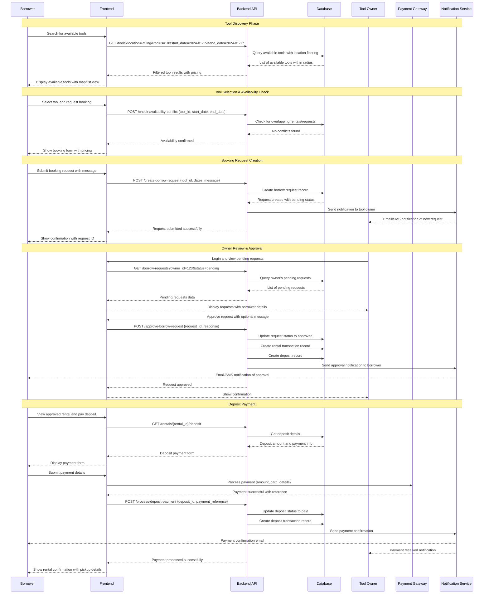
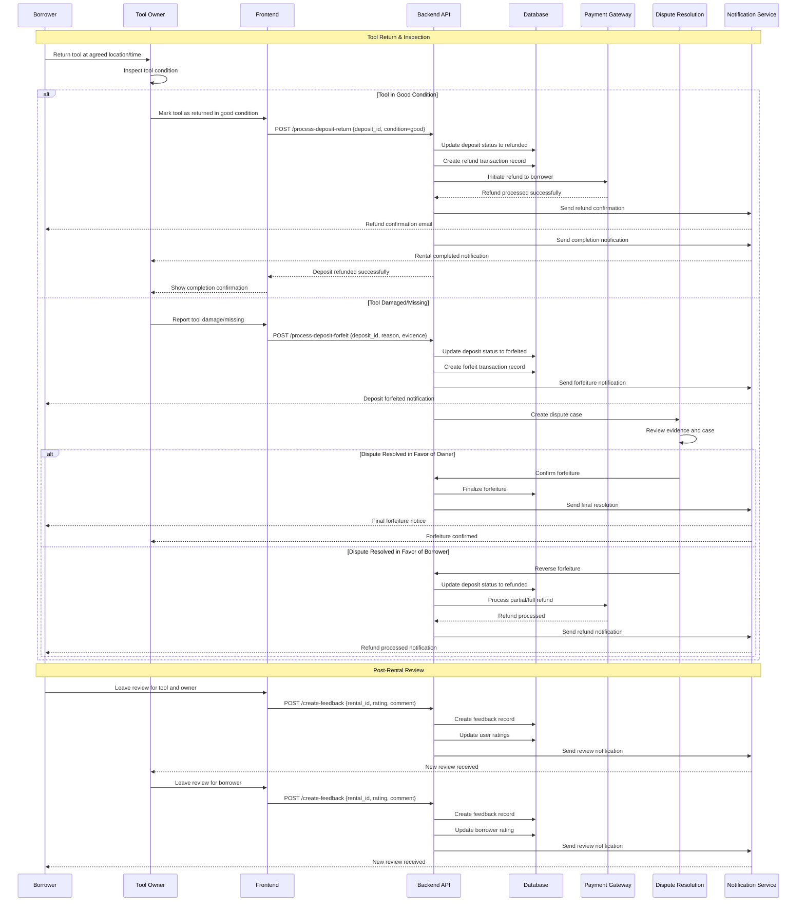
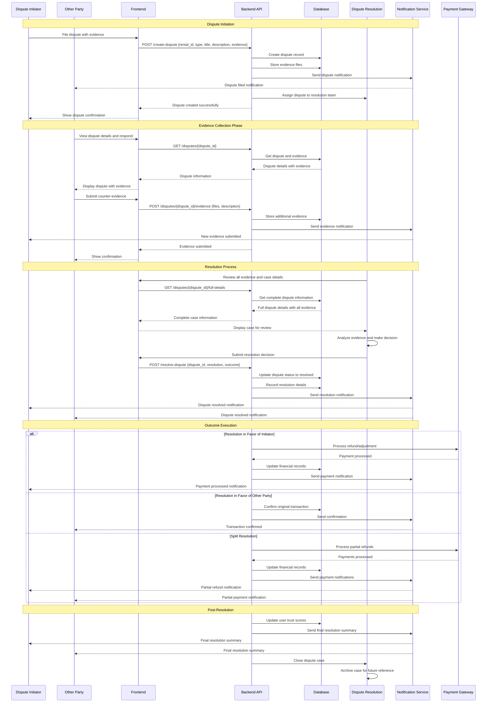
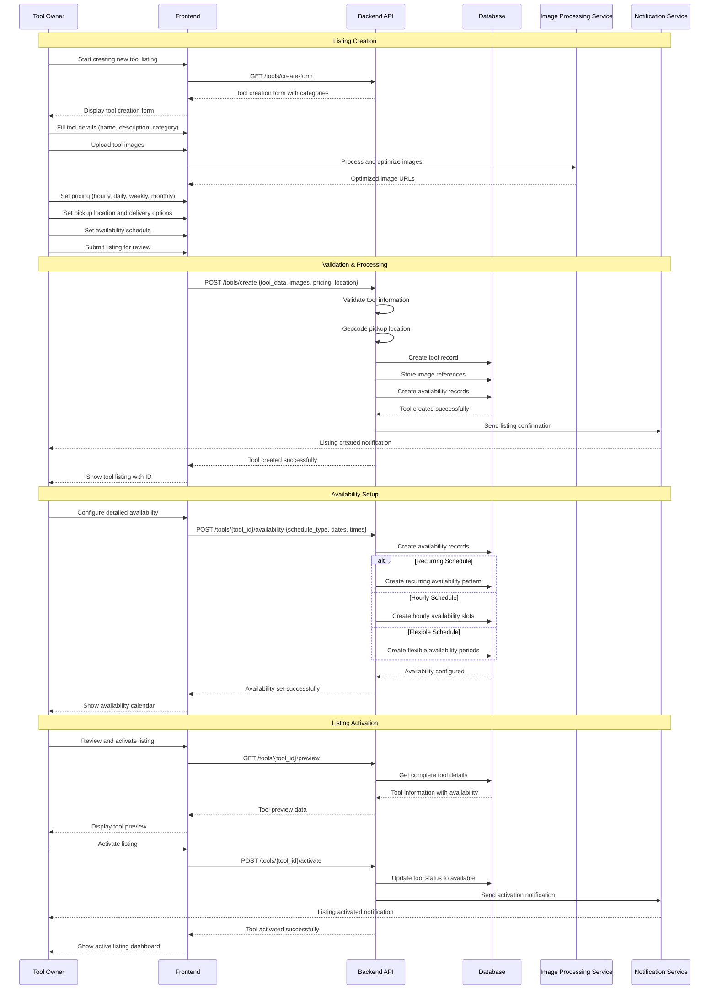

# ToolShare Key Workflows & Sequence Diagrams

## 1. Tool Booking Workflow

### Theoretical Sequence: "Book a Tool"

**Actors:** Borrower, Tool Owner, ToolShare System, Payment Gateway

**Preconditions:** 
- Borrower is authenticated and verified
- Tool is available for the requested dates
- Borrower has sufficient funds for deposit

**Main Flow:**

**Alternative Flows:**
- **Owner Rejects Request**: Owner can reject with reason, system notifies borrower
- **Request Expires**: Automatic expiration after 24 hours if not responded to
- **Payment Fails**: Retry payment or cancel booking
- **Availability Conflict**: System prevents booking if conflicts detected

---

## 2. Deposit Management Workflow

### Theoretical Sequence: "Handle Deposit Lifecycle"

**Actors:** Borrower, Tool Owner, ToolShare System, Payment Gateway, Dispute Resolution Team

**Preconditions:**
- Rental transaction exists with paid deposit
- Tool has been picked up and used
- Rental period has ended

**Main Flow:**

**Alternative Flows:**
- **Partial Damage**: Partial refund based on damage assessment
- **Late Return**: Additional fees or deposit forfeiture
- **Dispute Escalation**: Manual review by support team
- **Insurance Claim**: Third-party insurance processing

---

## 3. Dispute Resolution Workflow

### Theoretical Sequence: "Resolve Rental Dispute"

**Actors:** Dispute Initiator, Other Party, ToolShare Support, Dispute Resolution Team

**Preconditions:**
- Rental transaction exists
- Dispute has been initiated with evidence
- Both parties have been notified

**Main Flow:**

**Alternative Flows:**
- **Mediation Required**: Escalation to human mediator
- **Legal Involvement**: External legal process initiation
- **Appeal Process**: Dispute resolution appeal
- **Settlement Agreement**: Mutual agreement between parties

---

## 4. Tool Listing Creation Workflow

### Theoretical Sequence: "Create Tool Listing"

**Actors:** Tool Owner, ToolShare System, Image Processing Service

**Preconditions:**
- User is authenticated and verified as owner
- User has completed identity verification
- User has agreed to terms of service

**Main Flow:**

**Alternative Flows:**
- **Draft Saving**: Save incomplete listing for later completion
- **Listing Rejection**: System flags inappropriate content
- **Verification Required**: Additional verification for high-value tools
- **Category Review**: Manual review for new tool categories

---

## Key Workflow Characteristics

### **Security Measures:**
- **Authentication Required**: All workflows require user authentication
- **Authorization Checks**: Role-based access control for different actions
- **Data Validation**: Input validation at multiple layers
- **Audit Trails**: Complete transaction logging for all actions

### **Performance Optimizations:**
- **Caching**: Frequently accessed data cached for faster response
- **Async Processing**: Non-critical operations processed asynchronously
- **Database Indexing**: Optimized queries for common operations
- **CDN Integration**: Static assets served from content delivery networks

### **Error Handling:**
- **Graceful Degradation**: System continues operating despite component failures
- **Retry Mechanisms**: Automatic retry for transient failures
- **User Feedback**: Clear error messages and recovery suggestions
- **Fallback Options**: Alternative paths when primary operations fail

### **Scalability Considerations:**
- **Horizontal Scaling**: Stateless API design supports multiple instances
- **Database Sharding**: User data can be partitioned across multiple databases
- **Load Balancing**: Requests distributed across multiple servers
- **Microservices**: Different workflows can be handled by specialized services

These theoretical workflows provide the foundation for implementing robust, scalable, and user-friendly tool sharing functionality while maintaining security and performance standards. 